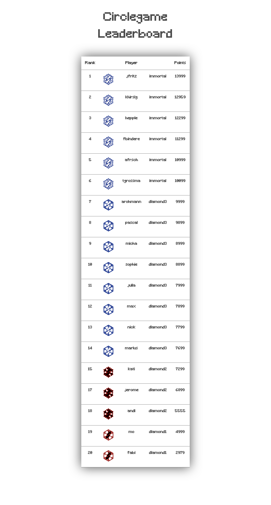
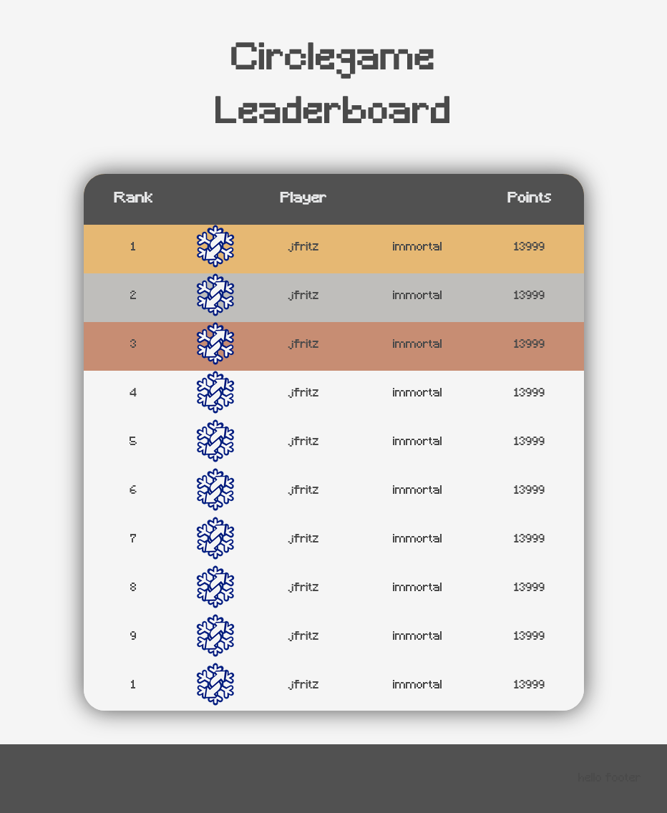

<h1 align="center">Circlegame frontend</h1>
<p align="center">Just a small frontend for the leaderboard of the Circlegame</p>



and the version in the **new** folder



## Download
You can download the project with the following command:
```
git clone git@github.com:arohmann111/circlegame_frontend.git
```
afterards navigate to the cloned repository and open the index.html file in your browser
